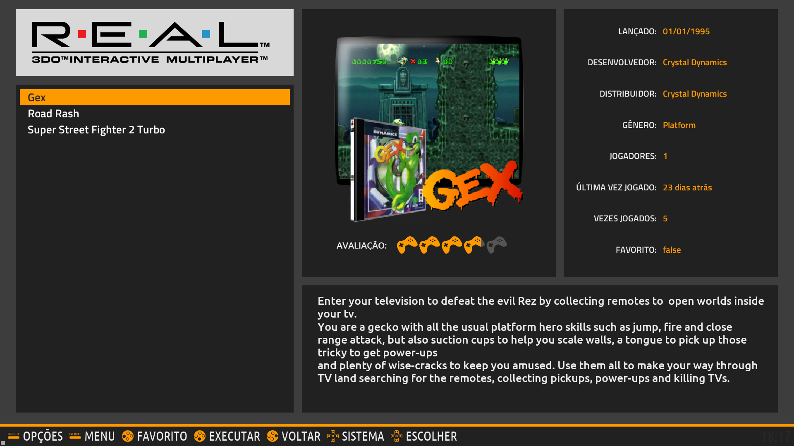
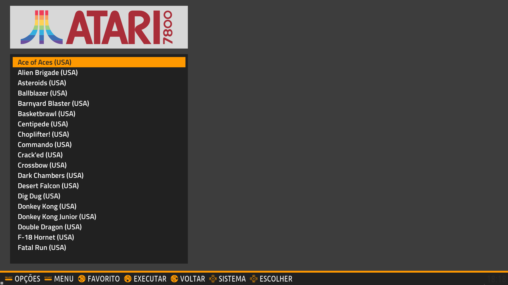
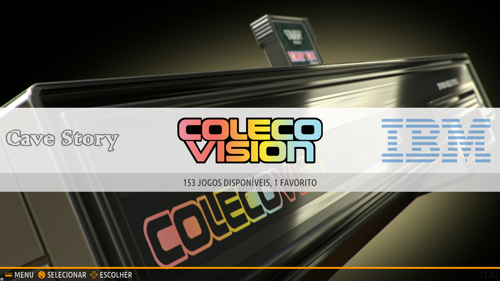
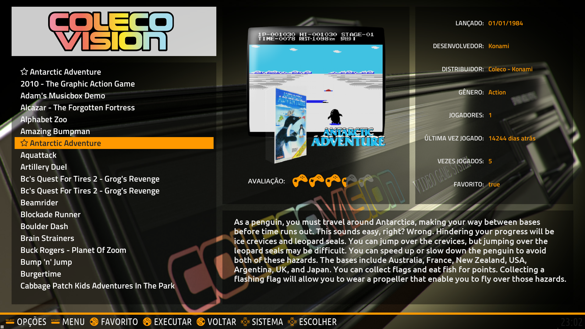

# Themes for EmulationStation

Theme for the Emulationstation Batocera with and without background image.

To change the background option edit the **chooseTheme.xml** file uncommenting the desired option.

    <!-- No image -->
    <!-- <pathBarckground>./../main/art/background.png</pathBarckground> -->
		
    <!-- Image -->
    <pathBarckground>./art/bg.jpg</pathBarckground>

## No image

## Image

